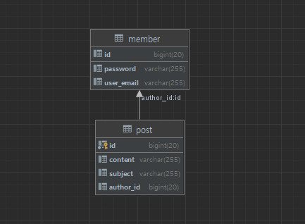

원티드 프리온보딩 백엔드 인턴십 사전 과제

성명 : 오현직

기술 스택 : Spring boot 2.7.6, JPA, Hibernate, Swagger, JWT, Mysql 8.0, JAVA 11

git Repo : https://github.com/hyujikoh/wanted-pre-onboarding-backend

swagger API : http://localhost:8010/swagger-ui/index.html

DB ERD Diagram 

구현 영상 : (링크 삽입)

구현 방식에 대한 설명

👻 작업 일자 👻

8/7
1. 프로젝트 생성
2. 도메인 템플릿 구축
3. 로컬 기준 db 환경 셋팅

8/8
1. member 도메인 회원가입 테스트 기반 기능 구현

8/9
1. 기존에 스프링 시큐리티를 사용한 방식 제거
2. 회원가입 API 기능 구현(테스트 코드 포함)
3. 로그인 API 기능 구현(테스트 코드 포함)

8/10
1. 게시글 생성(테스트 코드 미 포함)
2. 게시글 수정(테스트 코드 미 포함)

8/11
1. 게시글 CRUD 작성 완료(테스트 코드 포함)

8/12
1. 테스트 코드 리팩토링
2. 단위, 통합 테스트 완료

